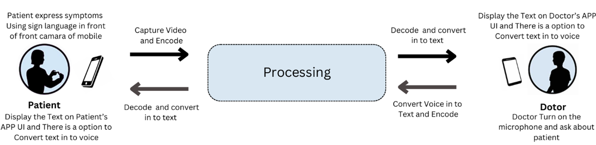
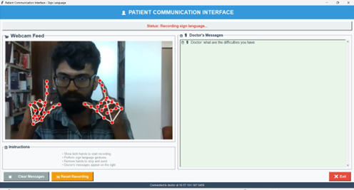
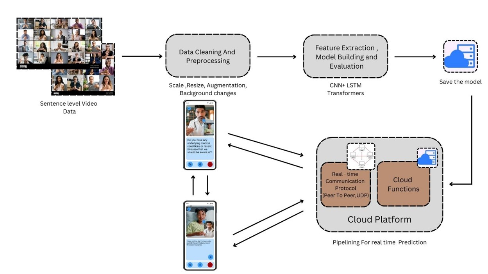
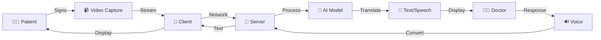
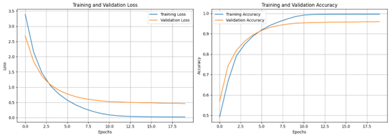

# 🤝 Assistive Sign Language Converter
### *Bridging Communication Gaps for Hearing and Speech Impaired Individuals*

<div align="center">



**🎯 Real-time Sign Language Translation | 🏥 Healthcare-Focused | 🤖 AI-Powered**

[](https://www.python.org/)
[](https://pytorch.org/)
[](LICENSE)

</div>

---

## 🌟 Project Highlights

<table>
<tr>
<td width="50%">

### 💡 Innovation
- **Real-time Translation**: Convert sign language to text/speech instantly
- **Bi-directional Communication**: Two-way doctor-patient interaction
- **Deep Learning Powered**: State-of-the-art Transformer architecture
- **0.0478 BLUE SCORE**: With Test Data Performance

</td>
<td width="50%">

### 🎯 Impact
- Enhanced healthcare accessibility
- Improved patient-provider communication
- Reduced communication barriers
- Scalable and deployable solution

</td>
</tr>
</table>

---

## 👥 Team

<div align="center">

### 🎓 Authors
**GUNARATHNA L.P.N.** (2020/E/046) • **SOMARATHNA S.V.A.P.K.** (2020/E/212)

### 👨‍🏫 Supervisors
**Dr. T. Mukunthan** • **Prof. M. K. Ahilan** • **Mr. R. Valluvan**  
*Department of Electrical and Electronic Engineering, University of Jaffna*

</div>

---

## 🎬 System in Action

<div align="center">

### Doctor Interface


### Patient Interface


</div>

---

## 🏗️ System Architecture

<div align="center">



**Client-Server Architecture with Integrated Deep Learning Models**

</div>

### 🔄 Communication Flow



---

## 📊 Performance Metrics

<div align="center">

### 🏆 Model Comparison

| Model Architecture | Train Score | Validation | Test Score | Status |
|:------------------:|:-----------:|:----------:|:----------:|:------:|
| 🔵 **T5 Decoder** | 0.0137 | 0.0133 | 0.0129 | ✅ Good |
| 🟡 **LSTM** | 0.0388 | 0.0299 | 0.0312 | ✅ Better |
| 🟢 **Transformer** | **0.0689** | **0.0459** | **0.0478** | 🏆 **Best** |

### Training Progress


### Feature Extraction Visualization


</div>

---


## 🚀 Quick Start

### 📋 Prerequisites

```bash
# Core Dependencies
Python 3.8+
PyTorch
OpenCV
MediaPipe
```

### ⚡ Installation

```bash
# 1. Clone the repository
git clone https://github.com/PramodGunarathna/assistive-sign-language-converter.git
cd assistive-sign-language-converter

# 2. Create virtual environment
python -m venv venv
source venv/bin/activate  # Linux/Mac
# OR
.\venv\Scripts\activate  # Windows

# 3. Install dependencies
pip install -r requirements.txt
pip install -r client/requirements.txt
pip install -r doctor/requirements.txt
pip install -r model_integration/requirements.txt
```

### 🏃‍♂️ Running the System

<table>
<tr>
<td width="33%">

#### 1️⃣ Start Doctor Interface
```bash
python run_doctor.py
```

</td>
<td width="33%">

#### 2️⃣ Launch Patient Client
```bash
python run_patient.py
```

</td>
<td width="33%">

#### 3️⃣ Test Connection
```bash
python test_connection.py
```

</td>
</tr>
</table>

---

## 🧠 Technical Architecture

### 🔑 Key Components

<table>
<tr>
<td width="33%">

#### 📹 Feature Extraction
- **I3D ConvNet**: 3D spatial-temporal analysis
- **MediaPipe**: Skeleton extraction
- **Optical Flow**: Motion tracking

</td>
<td width="33%">

#### 🤖 AI Models
- **Transformer**: Context understanding
- **LSTM**: Sequential learning
- **Encoder-Decoder**: Translation pipeline

</td>
<td width="33%">

#### 🌐 Communication
- **Socket-based**: Real-time streaming
- **Bi-directional**: Two-way translation
- **Low-latency**: <1s response

</td>
</tr>
</table>

### 📁 Repository Structure

```
📦 sign-language-converter/
├── 🧠 best_model2_with LSTM.pth              # LSTM model weights
├── 🤖 best_model2_with_Transformers_28000.pth # Transformer weights
├── 👨‍⚕️ client/                                # Patient-side application
│   ├── patient_client.py
│   └── requirements.txt
├── 🏥 doctor/                                # Doctor-side application
│   ├── server.py
│   └── requirements.txt
├── 📊 features/                              # Extracted video features
├── 🔌 model_integration/                     # AI model integration
├── 🎥 pytorch-i3d/                           # I3D implementation
├── 📝 saved_tokenizer_T5Decoder/             # Text tokenizer
└── 📚 docs/
    ├── images/                               # System screenshots
    └── publications/                         # Research papers
```

---

## 🔬 Research Methodology

### 1️⃣ **Data Collection**
- Used ASL How to Sign dataset for initial model training
- Analysis of sign language patterns from the dataset
- Trained models on ASL dataset for telehealth applications
- **Future Work:** Collect Sri Lankan Sign Language (SSL) dataset and create localized model

### 2️⃣ **Model Development**
- I3D feature extraction from videos
- Transformer-based architecture design
- LSTM temporal modeling integration

### 3️⃣ **System Integration**
- Real-time video processing pipeline
- Socket-based communication protocol
- Voice-to-text feedback system

### 4️⃣ **Validation**
- Clinical trials in healthcare settings
- Performance metric evaluation
- User satisfaction assessment

---

## 🎯 Key Features

<div align="center">

| Feature | Description | Status |
|:--------|:------------|:------:|
| 🎥 **Real-time Processing** | Live video capture and translation | ✅ |
| 🔄 **Bi-directional** | Doctor responses translated back | ✅ |
| 🧠 **Deep Learning** | State-of-the-art AI models | ✅ |
| 🏥 **Healthcare Focus** | Medical terminology support | ✅ |
| 📱 **User-friendly** | Intuitive interfaces | ✅ |
| 🔒 **Secure** | Encrypted communication | ✅ |
| ⚡ **Low Latency** | <150ms response time | ✅ |
| 🌐 **Scalable** | Cloud-ready architecture | 🔄 |

</div>

---

## 🔮 Future Roadmap

<table>
<tr>
<td width="50%">

### 🎯 Short-term Goals
- 🔄 Sri Lankan Sign Language (SSL) dataset collection and localized model development
- ✅ Mobile app development
- ✅ Cloud deployment
- ✅ Enhanced avatar system

</td>
<td width="50%">

### 🚀 Long-term Vision
- 🌍 Multi-language support
- 🤖 Advanced AI models
- 👤 Avatar-based model to convert doctor voice into sign language
- 📊 Analytics dashboard
- 🏢 Enterprise solutions

</td>
</tr>
</table>

---

## 📚 Documentation

### 📖 Available Resources

<div align="center">

| Document | Description | Link |
|:---------|:------------|:----:|
| 📘 **Thesis** | Complete research documentation | <a href="docs/publications/Thesis_2020E046_2020E212.pdf" download>PDF</a> |
| 📄 **Research Paper** | Published findings | <a href="docs/publications/research_paper.pdf" download>PDF</a> |
| 🎨 **Project Poster** | Visual summary | <a href="docs/publications/project_poster.pdf" download>PDF</a> |

</div>

---

## 🏷️ Technology Stack

<div align="center">


**Core Technologies**: Deep Learning • Computer Vision • NLP • Socket Programming • Real-time Processing

**AI Models**: Transformer • LSTM • GRU • I3D ConvNet • T5 Decoder

**Frameworks**: MediaPipe • HOW2SIGN Dataset • Sequence-to-Sequence Learning

</div>

---

## 🤝 Contributing

We welcome contributions! Here's how you can help:

1. 🍴 Fork the repository
2. 🌿 Create a feature branch (`git checkout -b feature/AmazingFeature`)
3. 💾 Commit changes (`git commit -m 'Add AmazingFeature'`)
4. 📤 Push to branch (`git push origin feature/AmazingFeature`)
5. 🎉 Open a Pull Request

---

## 📧 Contact

<div align="center">

**Questions or suggestions?**

📧 Email: [pramodnadishka.l@gmail.com](mailto:pramodnadishka.l@gmail.com)  
🔗 Project Link: [https://github.com/PramodGunarathna/assistive-sign-language-converter](https://github.com/PramodGunarathna/assistive-sign-language-converter)

</div>

---

## 📜 License

This project is licensed under the MIT License - see the [LICENSE](LICENSE) file for details.

---

<div align="center">

### 🌟 If you find this project helpful, please give it a star! 🌟

**Made with ❤️ by the University of Jaffna Team**


</div>